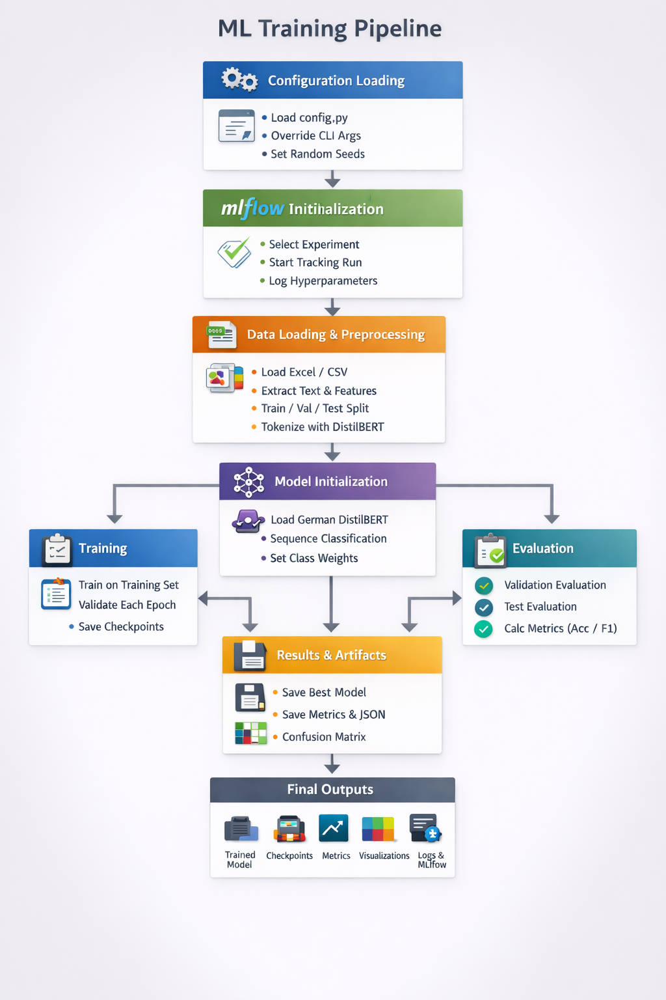

# 📦 Invoice Text Classification

This project solves the task of **automatically classifying invoice items** from German text descriptions into three categories:

- 🛠️ **labor** - Work-related items (e.g., "Sicherungskasten überprüft und beschriftet")
- 🔧 **material** - Material items (e.g., "Steckdose Unterputz weiß montiert")
- 📋 **other** - Other miscellaneous items

The system uses a fine-tuned **DistilBERT** model specifically trained on German text (`distilbert-base-german-cased`) to understand and categorize invoice descriptions. The model can also leverage additional features like quantity, unit, and price to improve classification accuracy.

---

## 🚀 Quick Start Guide

### Prerequisites

This project uses **[uv](https://docs.astral.sh/uv/)** for fast, reliable dependency management. Install uv if needed:

```bash
# Install uv (Windows PowerShell)
irm https://astral.sh/uv/install.ps1 | iex

# Install uv (macOS/Linux)
curl -LsSf https://astral.sh/uv/install.sh | sh
```

Then sync dependencies (CPU-only PyTorch, no GPU required):

```bash
uv sync
```

> **Using pip?** Run `uv export --no-emit-project > requirements.txt` to generate a `requirements.txt`, then `pip install -r requirements.txt`.

### Step 1: Train the Model

Run the training pipeline with uv:

```bash
uv run --directory src train_pipeline.py
```

#### 📁 Files Created During Training

When you run `train_pipeline.py`, the following files and directories are created:

- **`../models/best_model/`** 📦 - Contains the best trained model (tokenizer, model weights, config)
- **`../models/checkpoints/`** 💾 - Training checkpoints saved at each epoch
- **`../results/`** 📊 - Contains evaluation metrics and visualizations:
  - `train_metrics.json` - Training set metrics
  - `val_metrics.json` - Validation set metrics  
  - `test_metrics.json` - Test set metrics
  - `confusion_matrix_test.png` - Confusion matrix visualization
- **`../logs/`** 📝 - Training logs with timestamps
- **MLflow artifacts** 🗂️ - All metrics, models, and results are logged to MLflow for experiment tracking

To track the models artifacts run:

```bash
mlflow ui
```

### Step 2: Run Inference

After training, you can make predictions on new data:

```bash
uv run --directory src inference.py --input_csv ../data/new_data.csv
```

> **Note:** The `new_data.csv` file in the `data/` directory will be used by default if you specify it. The script requires the `--input_csv` argument to specify which CSV file to process.

The inference script will:
1. Load the trained model from `../models/best_model/`
2. Process the input CSV file
3. Generate predictions for each row
4. Save results to a new file with `_predictions` suffix (e.g., `new_data_predictions.csv`)

---

## 📚 Detailed Documentation

### 🏋️ Training Pipeline (`train_pipeline.py`)

The training pipeline orchestrates the entire model training process from data loading to model evaluation.

#### Command-Line Arguments

You can override configuration values using command-line arguments:

| Argument | Description | Default |
|----------|-------------|---------|
| `--model_save_dir` | Directory to save the trained model | Uses `config.training.model_save_dir` |
| `--output_dir` | Directory for training checkpoints | Uses `config.training.output_dir` |
| `--dataset_path` | Path to the training dataset file | Uses `config.data.dataset_path` |

#### Example Usage

```bash
# Use custom dataset path
uv run --directory src train_pipeline.py --dataset_path ../data/my_custom_dataset.csv

# Use custom model save directory
uv run --directory src train_pipeline.py --model_save_dir ../models/my_model

# Override multiple settings
uv run --directory src train_pipeline.py --dataset_path ../data/dataset.csv --model_save_dir ../models/production_model
```

#### Configuration File

The entire project uses a centralized configuration file (`config.py`) that controls:

- **Data Configuration** (`DataConfig`): Dataset paths, column names, train/test splits, feature usage
- **Model Configuration** (`ModelConfig`): Model architecture, number of labels, dropout
- **Training Configuration** (`TrainingConfig`): Learning rate, batch size, epochs, paths
- **MLflow Configuration** (`MLflowConfig`): Experiment tracking settings

All settings can be modified in `src/config.py` without changing the code.

#### Pipeline Architecture



---

### 🔮 Inference Pipeline (`inference.py`)

The inference pipeline loads a trained model and makes predictions on new, unlabeled data.

#### Command-Line Arguments

| Argument | Description | Required | Default |
|----------|-------------|----------|---------|
| `--input_csv` | Path to input CSV file with text data | ✅ Yes | - |
| `--model_path` | Path to saved model directory | ❌ No | Uses `config.training.model_save_dir` |
| `--output_csv` | Path to output CSV file | ❌ No | `{input_csv}_predictions.csv` |
| `--text_column` | Name of text column in CSV | ❌ No | Uses `config.data.text_column` |
| `--batch_size` | Batch size for inference | ❌ No | `32` |

#### Example Usage

```bash
# Basic inference with default settings
uv run --directory src inference.py --input_csv ../data/new_data.csv

# Use a specific model
uv run --directory src inference.py --input_csv ../data/new_data.csv --model_path ../models/custom_model

# Specify custom output location
uv run --directory src inference.py --input_csv ../data/new_data.csv --output_csv ../data/results.csv

# Use different text column name
uv run --directory src inference.py --input_csv ../data/new_data.csv --text_column description

# Adjust batch size for faster inference
uv run --directory src inference.py --input_csv ../data/new_data.csv --batch_size 64
```

#### Input CSV Format

The input CSV should be tab-separated and contain at minimum a text column. Optional columns include:

- `text` (or custom name) - The inventory description to classify
- `quantity` - Numeric quantity value (optional, used if `use_additional_features=True`)
- `unit` - Unit of measurement (optional)
- `price` - Price value (optional)

Example:
```csv
id	text	quantity	unit	price
400001	Am 05.01.2022 Sicherungskasten überprüft und beschriftet	1,5	Stunde	45
400002	Steckdose Unterputz weiß montiert	3	St	12,5
```

#### Output

The script generates a new CSV file with an additional `predicted_label` column containing the classification results:

```csv
id	text	quantity	unit	price	predicted_label
400001	Am 05.01.2022 Sicherungskasten überprüft und beschriftet	1,5	Stunde	45	labor
400002	Steckdose Unterputz weiß montiert	3	St	12,5	material
```

---

## 🌐 REST API

The project includes a FastAPI server for training, metrics, and inference via HTTP.

### Quick Start: Swagger Docs

**Start here.** Run the API, then open the interactive Swagger documentation:

```bash
uv run uvicorn api:app --reload --host 0.0.0.0 --port 8000 --app-dir src
```

Once the server is running, open **[http://localhost:8000/docs](http://localhost:8000/docs)** for the Swagger UI. You can explore all endpoints, view request/response schemas, and try requests directly from the browser.

Alternative docs (ReDoc): [http://localhost:8000/redoc](http://localhost:8000/redoc)

### Endpoints Overview

| Endpoint | Method | Description |
|----------|--------|-------------|
| `/train` | POST | Upload CSV dataset, start training in background. Returns 202 immediately. |
| `/metrics` | GET | Get test metrics (accuracy, precision, recall, f1) of the newest model. |
| `/predict` | POST | Upload CSV, receive CSV with `predicted_label` column. No server storage. |

### Example Usage (curl)

```bash
# Start training (returns 202, training runs in background)
curl -X POST -F "file=@data/dataset.csv" http://localhost:8000/train

# Get metrics (after training completes)
curl http://localhost:8000/metrics

# Run inference (returns CSV with predictions)
curl -X POST -F "file=@data/new_data.csv" http://localhost:8000/predict -o predictions.csv
```

**Note:** After training completes, restart the API to use the newly trained model for predictions.

---

## 🏗️ Project Structure

```
inventory-text-classification/
├── data/                    # 📁 Dataset files
│   ├── dataset.csv         # Training dataset
│   ├── api_uploads/        # Temp datasets from API training
│   └── new_data.csv        # New data for inference
├── src/                     # 📁 Source code
│   ├── api.py              # 🌐 FastAPI application
│   ├── config.py           # ⚙️ Configuration settings
│   ├── train_pipeline.py   # 🏋️ Training script
│   ├── inference.py        # 🔮 Inference script
│   ├── data_loader.py      # 📊 Data loading utilities
│   ├── model_trainer.py    # 🎓 Model training logic
│   └── utils.py            # 🛠️ Helper functions
├── models/                  # 📦 Trained models
│   ├── best_model/         # Best model checkpoint
│   └── checkpoints/        # Training checkpoints
├── results/                 # 📊 Evaluation results
│   ├── *_metrics.json      # Metrics files
│   └── confusion_matrix_*.png
├── logs/                    # 📝 Training logs
├── pyproject.toml          # 📋 Project config & dependencies
├── uv.lock                  # 🔒 Locked dependency versions
└── README.md               # 📖 This file
```

---

## 🎨 Features

- ✅ **uv** - Fast dependency management with `uv sync` and `uv run`
- ✅ **CPU-Only** - Runs entirely on CPU, no GPU required
- ✅ **German Language Support** - Uses DistilBERT specifically trained on German text
- ✅ **Multi-Feature Input** - Can leverage quantity, unit, and price features
- ✅ **MLflow Integration** - Complete experiment tracking and model versioning
- ✅ **Reproducible** - Fixed random seeds and comprehensive logging
- ✅ **Flexible Configuration** - Centralized config file with CLI overrides
- ✅ **Production Ready** - Clean code structure with error handling
- ✅ **REST API** - FastAPI endpoints for training, metrics, and inference

---

## 📝 License

See `LICENSE` file for details.

---

## 👥 Author

Lukas Burtscher

